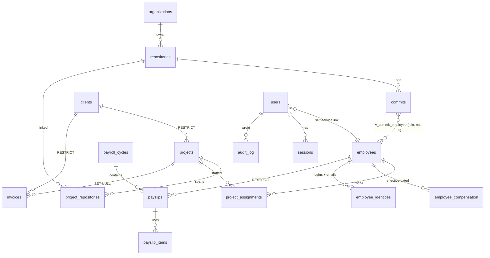

# GitHub OC Tracker → **Agency OS**
## Definitive implementation plan — v1

*Repo:* `mtalhazulf/github-oc-tracker` · *Branch base:* `claude/github-commit-tracker-org-604xbn`
*Stack (unchanged):* Bun · Hono · `hono/jsx` SSR · HTMX 2 · Tailwind v4 · `bun:sqlite` (WAL) · single Docker container
*Baseline verified:* 36 tests pass · `src/db/store.ts` = 699 lines / 43 methods · `src/web/routes.tsx` = 330 lines · migrations at v2

---

## 1. Executive summary

The commit tracker becomes the **operating system for a service software house**: the same SQLite file that already knows *who pushed what, when* also knows who those people are, what they cost, which client project they were working on, what that project was sold for, what has been invoiced, and what was paid out on the 1st. Commits stop being a vanity chart and become the activity substrate under project, client and person. Everything stays server-rendered, single-container, and small enough for one person to operate.

**Five headline capabilities**

| # | Capability | Why it earns its place |
|---|---|---|
| 1 | **Delivery ledger** — Clients, Projects (client project **or** internal product), each project spanning **N repositories** | The many-to-many repo link is the join that turns commit data into project data |
| 2 | **People** — Employees, **effective-dated** compensation, GitHub identity mapping with a bot/ignore list | A person is `ayeshak`, `AyeshaK`, `ayesha@house.pk` and `12345+ayeshak@users.noreply.github.com`. One row. |
| 3 | **Payroll** — monthly cycles, immutable snapshotted payslips, generic earning/deduction lines, **owner-configured tax slabs**, CSV export + print view | Payroll that cannot be exported is not payroll |
| 4 | **Economics** — invoices + AR aging (money in), **actual** project cost derived from payslips (money out), capacity grid + **bench %** (the agency KPI) | Answers "who owes me money", "is this project profitable", "who is free in September" |
| 5 | **Accounts, roles, audit log, one-click backup** | Salaries must not be visible to everyone holding the dashboard password, and payroll history exists nowhere else |

**Explicitly out of scope for v1** (each is a deliberate cut, not an oversight):

timesheets / hours tracking · expenses · leave & attendance module · branded PDF invoices · multi-tenancy · FX conversion & multi-currency rollups · tasks/sprints/milestones · email or push notifications · SSO/OIDC · a general-purpose public write API · custom fields · per-client portals.

---

## 2. Product model

### 2.1 Reality → entities

| Reality in the house | Entity | Notes |
|---|---|---|
| "Northwind Ltd pays us in USD, net 30" | `clients` | 1 contact inline (`contact_name`, `contact_email`), no contacts table |
| "Northwind Portal, fixed price $120k, Mar–Dec" | `projects` (`kind='client'`) | Must have a client, must have a billing model |
| "Our own scheduling product" | `projects` (`kind='internal_product'`) | **Cannot** have a client, **cannot** be invoiced |
| "Infra, hiring, internal tooling" | `projects` (`kind='internal_ops'`) | Same rules as internal product; keeps bench-adjacent work visible |
| "That project lives in 3 repos" | `project_repositories` (M:N + `is_primary`) | The core requirement |
| "Ayesha, tech lead, joined Feb 2024" | `employees` | Soft-deletable; `status`/`exited_on` are HR facts, `archived_at` is a UI concern |
| "Ayesha got a raise in January" | `employee_compensation` | Append-only, effective-dated, no `effective_to` |
| "Ayesha's GitHub handles and emails" | `employee_identities` | `UNIQUE(kind, value)` NOCASE — the no-fan-out guarantee |
| "dependabot[bot] is not an employee" | `ignored_authors` | Without this the mapping inbox never empties and the feature dies |
| "Ayesha is 60% on Northwind, 40% internal" | `project_assignments` | Drives capacity, bench, and actual cost allocation |
| "July payroll" | `payroll_cycles` → `payslips` → `payslip_items` | Payslip is a **document**, fully snapshotted |
| "Invoice NW-2026-07, $30k, due 30 Aug" | `invoices` | 10 columns; makes AR aging and real revenue possible |
| "Who can see salaries" | `users`, `sessions`, `audit_log` | Roles: owner / admin / manager / member |

### 2.2 Client project vs internal product

The distinction is enforced by the database, not by a comment:

```sql
CHECK ((kind = 'client') = (client_id IS NOT NULL))   -- client work names its client; internal work cannot have one
CHECK (kind = 'client' OR billing_model = 'none')     -- internal work is never invoiced
```

Everything else is shared: internal products have repos, a team, assignments, an activity feed, and a real payroll-derived cost. They just never appear in AR, never carry a budget the client agreed to, and are excluded from "billable" rollups. That is exactly the owner's stated reality, and modelling it as one table with two CHECKs beats two parallel tables that would fork every query.

### 2.3 Commits → business insight, in one line

```
commit.author_login/email → employee_identities → employee → project_assignments  ┐
commit.repo_id            → project_repositories → project → client               ┘ → cost, revenue, margin
```

Attribution is a **join, never a stored column**: fixing an identity or re-linking a repo corrects history instantly with no re-sync.

---

## 3. Architecture

### 3.1 Four layers, one-way imports

```
domain/        pure TS: types, validators, money, dates, tax, RBAC. No bun:sqlite, no hono, no .tsx
   ↓
db/stores/     SQL only. One file per aggregate. Assumes validated input.
   ↓
services/      business rules, cross-record checks, transactions. No hono, no JSX.
   ↓
adapters:  web/  (HTMX + SSR, primary)          api/v1/  (JSON, minimal, Phase 6)
```

**The rule: the HTMX UI calls services in-process. It never makes an HTTP request to `/api/v1`.**
Three reasons, all concrete:

1. `bun:sqlite` transactions are synchronous and process-local. `svc.projects.create()` runs `store.tx(() => { insertProject(); linkRepos(); })`. An HTTP hop puts those two writes in different call stacks — nothing can roll back.
2. `/api/v1` requires a bearer token. The UI would need the server to mint and hold a token to talk to itself.
3. Every form post becomes two round trips, plus a new failure mode (`config.baseUrl` defaults to `http://localhost:3000` and is routinely wrong behind Docker).

**Corollary for reads:** a read-only HTML route may call a store directly (`store.listRepos()` for a `<select>`). Any **write**, and any read that applies a business rule, goes through a service. This keeps the existing dashboard/commits/repos routes almost untouched instead of forcing pass-through service methods that add nothing.

> **Judgement call — requirement #8.** "Separate UI from API calls as well properly" is satisfied by the **services layer** (routes contain zero SQL; views contain zero data access), not by building a public REST API. A token-authenticated JSON API with an OpenAPI spec, a docs page, DTO mappers and idempotency keys would be ~1,000 lines serving zero consumers. Section 5 designs a deliberately small JSON surface, and it ships **last**.

### 3.2 Directory tree (final)

```
src/
  domain/                      # pure — no bun:sqlite, no hono, no .tsx
    errors.ts                  # AppError, ValidationError, ConflictError, NotFoundError, FieldErrors
    validate.ts                # ~120-line Reader/parse kernel (no zod)
    money.ts                   # minor-unit arithmetic + parsing + allocation
    period.ts                  # YYYY-MM / YYYY-MM-DD helpers (tz-aware entry points)
    tax.ts                     # computeTax(annualMinor, slabs) — pure
    rbac.ts                    # Role, Capability, can(role, capability)
    employee.ts client.ts project.ts payroll.ts invoice.ts   # parsers + input types
  db/
    index.ts                   # +duplicate-version guard in migrate()
    migrations.ts              # append v3..v8
    sql.ts                     # createSqlHelpers(db) → { tx }
    store.ts                   # EXISTING 43 methods untouched + spread of new stores
    stores/
      settings.ts employees.ts clients.ts projects.ts
      payroll.ts invoices.ts attribution.ts auth.ts economics.ts
  services/
    index.ts                   # createServices(deps) → Services
    employees.ts clients.ts projects.ts identities.ts
    payroll.ts invoices.ts economics.ts auth.ts backup.ts
  github/ sync/                # unchanged
  web/
    http.tsx                   # page() partial() friendlyError() PER_PAGE csrfInput()
    routes.tsx                 # EXISTING 5 sections stay; signature → createRoutes(ctx)
    routes/
      employees.tsx clients.tsx projects.tsx people.tsx
      payroll.tsx invoices.tsx economics.tsx auth.tsx settings-extra.tsx
    views/
      Layout.tsx               # top bar → sidebar
      ui/                      # the UI kit (§6.2)
      <NewPages>.tsx
      components/              # existing charts + Icon.tsx
    webhooks.ts                # path unchanged — a test imports it
  api/v1/
    index.ts auth.ts respond.ts
  app.ts index.ts config.ts logger.ts
```

**What is NOT in this tree, on purpose:** `src/db/repositories/*` (the existing 699 lines stay put — see §10.2), `api/v1/{dto,openapi,idempotency}.ts`, `openapi.json`, a docs page, `domain/query.ts` (generic list-query parser), `tests/layering.test.ts`.

### 3.3 End-to-end trace: "create a project with 2 repos"

**Shared core** — `src/domain/project.ts`:

```ts
export interface ProjectInput {
  code: string; name: string;
  kind: "client" | "internal_product" | "internal_ops";
  client_id: number | null;
  billing_model: "fixed_price" | "time_materials" | "retainer" | "none";
  currency: string; budget_minor: number | null;
  rate_hourly_minor: number | null; retainer_monthly_minor: number | null;
  start_on: string | null; end_on: string | null;
  description: string | null;
  repo_ids: number[]; primary_repo_id: number | null;
}

export function parseProject(body: Record<string, unknown>): ProjectInput {
  const r = reader(body);                                  // domain/validate.ts
  const kind = r.enum("kind", ["client", "internal_product", "internal_ops"]);
  const input: ProjectInput = {
    code: r.slug("code", { max: 32 }),
    name: r.text("name", { max: 120 }),
    kind,
    client_id: kind === "client" ? r.int("client_id") : null,
    billing_model: kind === "client"
      ? r.enum("billing_model", ["fixed_price", "time_materials", "retainer"])
      : "none",
    currency: r.currency("currency"),
    budget_minor: r.money("budget", "currency", { optional: true }),
    // ...
    repo_ids: r.intList("repo_ids"),
    primary_repo_id: r.int("primary_repo_id", { optional: true }),
  };
  r.throwIfErrors();          // → ValidationError with FieldErrors keyed by HTML input name
  return input;
}
```

**Service** — `src/services/projects.ts` (the only place business rules live):

```ts
create(input: ProjectInput, actor: Actor): number {
  if (input.kind === "client" && !this.store.getClient(input.client_id!)) {
    throw new ValidationError({ client_id: "Pick a client." });
  }
  const clash = this.store.getProjectByCode(input.code);          // includes archived
  if (clash) throw new ConflictError(
    clash.archived_at ? `“${clash.name}” is archived under this code.` : "Code already in use.",
    { code: "Already used." }, clash.archived_at ? { restoreId: clash.id } : undefined);

  return this.store.tx(() => {                                    // SYNC only — see §11 risks
    const id = this.store.insertProject(clearIrrelevantMoney(input));
    for (const repoId of input.repo_ids) {
      this.store.linkRepo(id, repoId, repoId === input.primary_repo_id);
    }
    this.audit(actor, "project.create", "project", id, input.name);
    return id;
  });
}
```

**HTMX adapter** — `src/web/routes/projects.tsx`:

```tsx
app.post("/projects", async (c) => {
  const body = await c.req.parseBody({ all: true });
  try {
    const id = svc.projects.create(parseProject(body), actorOf(c));
    c.header("HX-Redirect", `/projects/${id}`);
    return c.body(null, 201);
  } catch (err) {
    if (err instanceof ValidationError || err instanceof ConflictError) {
      return partial(c, <ProjectForm values={body} errors={err.fields} hint={err.hint} />, 422);
    }
    throw err;
  }
});
```

**JSON adapter** — `src/api/v1/projects.ts`:

```ts
app.post("/projects", async (c) => {
  try {
    const id = svc.projects.create(parseProject(await c.req.json()), actorOf(c));
    return ok(c, svc.projects.get(id), 201);
  } catch (err) { return fail(c, err); }   // ValidationError → 422 {error:{code,message,fields}}
});
```

Identical validation, identical rules, identical transaction. The adapters differ only in how they read the body and render the outcome. `FieldErrors` is keyed by the **HTML input name**, which is also the JSON body key — that is what makes one error object render correctly on both surfaces.

---

## 4. Data model

### 4.1 Migration order — the single authoritative list

Version collisions between the design tracks are resolved here. **Each migration is owned by exactly one delivery phase**, which is why they are not collapsed into one: real deployments will sit at v3-only for a week while Phase 2 is built.

| Version | Name | Phase | Contents |
|---|---|---|---|
| 1 | initial schema | shipped | orgs, repositories, commits, sync_runs |
| 2 | github app, installations, webhooks | shipped | github_app, installations, webhook_events |
| **3** | people, identities, settings | P1 | `app_settings`, `employees`, `employee_compensation`, `employee_identities`, `ignored_authors`, 2 NOCASE commit indexes, `v_commit_employee` |
| **4** | delivery: clients, projects, repo links | P2 | `clients`, `projects`, `project_repositories`, `project_assignments`, `repositories.last_commit_ts` + backfill, `v_repo_project` |
| **5** | accounts, sessions, audit | P3 | `users`, `sessions`, `audit_log` |
| **6** | payroll | P4 | `payroll_cycles`, `payslips`, `payslip_items`, `tax_slabs` |
| **7** | invoices | P5 | `invoices` |
| **8** | api tokens | P6 | `api_tokens` |

Enforced by `tests/migrations.test.ts`: versions are unique, strictly ascending, start at 1, and have no gaps. `migrate()` gains a pre-loop guard so a duplicate version fails with a named error rather than `UNIQUE constraint failed: schema_migrations.version` inside a transaction at boot.

```ts
// src/db/index.ts — add before the loop
const seen = new Set<number>();
for (const m of migrations) {
  if (seen.has(m.version)) throw new Error(`Duplicate migration version ${m.version} ("${m.name}")`);
  seen.add(m.version);
}
```

### 4.2 Conventions

| Concern | Rule |
|---|---|
| **Money** | `INTEGER` minor units, column suffix `_minor`, **scale is always 100** for every currency. Every table holding money carries its own `currency TEXT` (ISO-4217, uppercase, CHECK'd). |
| **Display digits** | Per-currency *display* only: PKR → 0 fraction digits, USD/EUR/GBP → 2. `fmtMoney(30000000, "PKR") === "PKR 300,000"`. Storage scale never varies. |
| **Never** | Sum `_minor` across different `currency` values. Group by currency. No FX conversion in v1. |
| **Business dates** | `TEXT 'YYYY-MM-DD'`, CHECK `GLOB '[0-9][0-9][0-9][0-9]-[0-9][0-9]-[0-9][0-9]'`. **Not** `GLOB '____-__-__'` — in GLOB, `_` is a literal, so that pattern rejects every valid date. |
| **Periods** | `TEXT 'YYYY-MM'`, CHECK `GLOB '[0-9][0-9][0-9][0-9]-[0-9][0-9]'` |
| **Event timestamps** | `INTEGER` unixepoch, matching v1/v2. `updated_at` set explicitly by the store on every UPDATE. **No triggers.** |
| **Soft delete** | `archived_at INTEGER` on exactly three tables: `clients`, `employees`, `projects`. Everything else cascades or is immutable history. |
| **Migrations** | Pure DDL only, plus the two seed/backfill statements noted inline. `db.exec()` does **not** throw on a mid-batch *runtime* failure — a data statement can silently no-op while the migration is recorded as applied. Every migration's post-state is asserted by a test. |

### 4.3 Relationship diagram



### 4.4 Migration v3 — people, identities, settings

```sql
CREATE TABLE app_settings (
  id INTEGER PRIMARY KEY CHECK (id = 1),
  company_name TEXT NOT NULL DEFAULT 'My Software House',
  base_currency TEXT NOT NULL DEFAULT 'PKR'
    CHECK (length(base_currency) = 3 AND base_currency = upper(base_currency)),
  payroll_currency TEXT NOT NULL DEFAULT 'PKR'
    CHECK (length(payroll_currency) = 3 AND payroll_currency = upper(payroll_currency)),
  fiscal_year_start_month INTEGER NOT NULL DEFAULT 7 CHECK (fiscal_year_start_month BETWEEN 1 AND 12),
  updated_at INTEGER NOT NULL DEFAULT (unixepoch())
);
INSERT INTO app_settings (id) VALUES (1);

CREATE TABLE employees (
  id INTEGER PRIMARY KEY AUTOINCREMENT,
  code TEXT NOT NULL UNIQUE COLLATE NOCASE,
  full_name TEXT NOT NULL COLLATE NOCASE,
  work_email TEXT UNIQUE COLLATE NOCASE,
  phone TEXT,
  designation TEXT,
  department TEXT,
  employment_type TEXT NOT NULL DEFAULT 'full_time'
    CHECK (employment_type IN ('full_time','part_time','contract','intern')),
  joined_on TEXT NOT NULL CHECK (joined_on GLOB '[0-9][0-9][0-9][0-9]-[0-9][0-9]-[0-9][0-9]'),
  exited_on TEXT CHECK (exited_on IS NULL OR exited_on GLOB '[0-9][0-9][0-9][0-9]-[0-9][0-9]-[0-9][0-9]'),
  status TEXT NOT NULL DEFAULT 'active' CHECK (status IN ('active','on_leave','notice','exited')),
  avatar_url TEXT,
  notes TEXT,
  created_at INTEGER NOT NULL DEFAULT (unixepoch()),
  updated_at INTEGER NOT NULL DEFAULT (unixepoch()),
  archived_at INTEGER,
  CHECK (exited_on IS NULL OR exited_on >= joined_on)
);

-- Append-only. A row is in force from effective_from until the next row starts.
-- No effective_to: one boundary per row means gaps and overlaps are unrepresentable.
CREATE TABLE employee_compensation (
  id INTEGER PRIMARY KEY AUTOINCREMENT,
  employee_id INTEGER NOT NULL REFERENCES employees(id) ON DELETE CASCADE,
  effective_from TEXT NOT NULL CHECK (effective_from GLOB '[0-9][0-9][0-9][0-9]-[0-9][0-9]-[0-9][0-9]'),
  currency TEXT NOT NULL DEFAULT 'PKR' CHECK (length(currency) = 3 AND currency = upper(currency)),
  base_monthly_minor INTEGER NOT NULL CHECK (base_monthly_minor >= 0),
  reason TEXT,
  created_at INTEGER NOT NULL DEFAULT (unixepoch()),
  UNIQUE (employee_id, effective_from)
);
-- NO separate lookup index: the UNIQUE auto-index already serves
-- (employee_id = ? AND effective_from <= ?) as a COVERING INDEX seek. Verified.

-- One identity belongs to exactly one employee. That UNIQUE is what guarantees
-- the commit→employee join can never fan out, so COUNT(*) over it is a true count.
CREATE TABLE employee_identities (
  id INTEGER PRIMARY KEY AUTOINCREMENT,
  employee_id INTEGER NOT NULL REFERENCES employees(id) ON DELETE CASCADE,
  kind TEXT NOT NULL CHECK (kind IN ('login','email')),
  value TEXT NOT NULL COLLATE NOCASE,
  source TEXT NOT NULL DEFAULT 'manual' CHECK (source IN ('manual','suggested','import')),
  created_at INTEGER NOT NULL DEFAULT (unixepoch()),
  UNIQUE (kind, value)
);
CREATE INDEX idx_employee_identities_employee ON employee_identities(employee_id, kind);

-- Bots and one-off outside contributors. Without this the mapping inbox never
-- reaches zero and the whole identity feature is abandoned in week one.
-- 'pattern' values use SQL LIKE semantics (SQLite LIKE has no bracket classes,
-- so '%[bot]' matches the literal suffix "[bot]").
CREATE TABLE ignored_authors (
  id INTEGER PRIMARY KEY AUTOINCREMENT,
  kind TEXT NOT NULL CHECK (kind IN ('login','email','pattern')),
  value TEXT NOT NULL COLLATE NOCASE,
  note TEXT,
  created_at INTEGER NOT NULL DEFAULT (unixepoch()),
  UNIQUE (kind, value)
);
INSERT INTO ignored_authors (kind, value, note) VALUES
  ('pattern','%[bot]','GitHub bot accounts'),
  ('login','dependabot','Dependabot'),
  ('login','github-actions','GitHub Actions'),
  ('login','renovate','Renovate');

-- GitHub logins and git emails are case-insensitive; the v1 indexes are BINARY.
-- These are the indexes attribution joins use — but ONLY with the identity
-- column on the LEFT of the comparison (see §7.2).
CREATE INDEX idx_commits_author_login_ci ON commits(author_login COLLATE NOCASE);
CREATE INDEX idx_commits_author_email_ci ON commits(author_email COLLATE NOCASE);

-- Commit → employee. Login wins over email. NULL = unmapped.
-- Emits exactly one row per commit (UNIQUE(kind,value) prevents fan-out).
CREATE VIEW v_commit_employee AS
SELECT c.id AS commit_id, c.repo_id AS repo_id, c.author_ts AS author_ts,
       COALESCE(il.employee_id, ie.employee_id) AS employee_id
FROM commits c
LEFT JOIN employee_identities il ON il.kind = 'login' AND il.value = c.author_login
LEFT JOIN employee_identities ie ON ie.kind = 'email' AND ie.value = c.author_email;
```

**Cut from the original design, with reasons:** `employee_compensation.cost_hourly_minor` / `bill_hourly_minor` / `cost_monthly_minor` (no query reads them without timesheets; actual cost comes from payslips instead — §8.4); `employees.manager_id` + its index (an org chart for 15 people); `idx_employee_comp_lookup` (verified redundant with the UNIQUE auto-index); `currency_rates` (a table nothing reads is worse than no table — it lands with the FX feature).

### 4.5 Migration v4 — delivery

```sql
CREATE TABLE clients (
  id INTEGER PRIMARY KEY AUTOINCREMENT,
  name TEXT NOT NULL COLLATE NOCASE,
  code TEXT NOT NULL UNIQUE COLLATE NOCASE,
  status TEXT NOT NULL DEFAULT 'active' CHECK (status IN ('prospect','active','paused','churned')),
  currency TEXT NOT NULL DEFAULT 'PKR' CHECK (length(currency) = 3 AND currency = upper(currency)),
  country TEXT, website TEXT,
  contact_name TEXT, contact_email TEXT,        -- replaces a whole client_contacts table
  billing_email TEXT, billing_address TEXT, tax_id TEXT,
  payment_terms_days INTEGER NOT NULL DEFAULT 30 CHECK (payment_terms_days >= 0),
  notes TEXT,
  created_at INTEGER NOT NULL DEFAULT (unixepoch()),
  updated_at INTEGER NOT NULL DEFAULT (unixepoch()),
  archived_at INTEGER
);

CREATE TABLE projects (
  id INTEGER PRIMARY KEY AUTOINCREMENT,
  code TEXT NOT NULL UNIQUE COLLATE NOCASE,
  name TEXT NOT NULL COLLATE NOCASE,
  kind TEXT NOT NULL DEFAULT 'client'
    CHECK (kind IN ('client','internal_product','internal_ops')),
  client_id INTEGER REFERENCES clients(id) ON DELETE RESTRICT,
  status TEXT NOT NULL DEFAULT 'active'
    CHECK (status IN ('discovery','active','paused','completed','cancelled')),
  billing_model TEXT NOT NULL DEFAULT 'time_materials'
    CHECK (billing_model IN ('fixed_price','time_materials','retainer','none')),
  currency TEXT NOT NULL DEFAULT 'PKR' CHECK (length(currency) = 3 AND currency = upper(currency)),
  budget_minor INTEGER CHECK (budget_minor IS NULL OR budget_minor >= 0),
  rate_hourly_minor INTEGER CHECK (rate_hourly_minor IS NULL OR rate_hourly_minor >= 0),
  retainer_monthly_minor INTEGER CHECK (retainer_monthly_minor IS NULL OR retainer_monthly_minor >= 0),
  start_on TEXT CHECK (start_on IS NULL OR start_on GLOB '[0-9][0-9][0-9][0-9]-[0-9][0-9]-[0-9][0-9]'),
  end_on   TEXT CHECK (end_on   IS NULL OR end_on   GLOB '[0-9][0-9][0-9][0-9]-[0-9][0-9]-[0-9][0-9]'),
  description TEXT,
  created_at INTEGER NOT NULL DEFAULT (unixepoch()),
  updated_at INTEGER NOT NULL DEFAULT (unixepoch()),
  archived_at INTEGER,
  CHECK ((kind = 'client') = (client_id IS NOT NULL)),
  CHECK (kind = 'client' OR billing_model = 'none'),
  CHECK (end_on IS NULL OR start_on IS NULL OR end_on >= start_on)
);
CREATE INDEX idx_projects_client ON projects(client_id, status);

-- A project spans N repos; a repo may feed N projects.
CREATE TABLE project_repositories (
  project_id INTEGER NOT NULL REFERENCES projects(id) ON DELETE CASCADE,
  repo_id    INTEGER NOT NULL REFERENCES repositories(id) ON DELETE CASCADE,
  is_primary INTEGER NOT NULL DEFAULT 0,
  linked_at  INTEGER NOT NULL DEFAULT (unixepoch()),
  PRIMARY KEY (project_id, repo_id)
);
CREATE INDEX idx_project_repositories_repo ON project_repositories(repo_id);
-- At most one project may claim a repo as primary → cross-project rollups
-- attribute each commit exactly once instead of double-counting shared repos.
CREATE UNIQUE INDEX idx_project_repositories_primary
  ON project_repositories(repo_id) WHERE is_primary = 1;

CREATE TABLE project_assignments (
  id INTEGER PRIMARY KEY AUTOINCREMENT,
  project_id  INTEGER NOT NULL REFERENCES projects(id) ON DELETE CASCADE,
  employee_id INTEGER NOT NULL REFERENCES employees(id) ON DELETE CASCADE,
  role TEXT NOT NULL DEFAULT 'engineer',
  allocation_pct INTEGER NOT NULL DEFAULT 100 CHECK (allocation_pct BETWEEN 0 AND 100),
  start_on TEXT NOT NULL CHECK (start_on GLOB '[0-9][0-9][0-9][0-9]-[0-9][0-9]-[0-9][0-9]'),
  end_on   TEXT CHECK (end_on IS NULL OR end_on GLOB '[0-9][0-9][0-9][0-9]-[0-9][0-9]-[0-9][0-9]'),
  created_at INTEGER NOT NULL DEFAULT (unixepoch()),
  UNIQUE (project_id, employee_id, start_on),
  CHECK (end_on IS NULL OR end_on >= start_on)
);
CREATE INDEX idx_project_assignments_employee ON project_assignments(employee_id, end_on);
CREATE INDEX idx_project_assignments_project  ON project_assignments(project_id, end_on);

-- Denormalised so the clients list never runs a correlated MAX(author_ts) over
-- commits. Measured: that subquery cost 108ms for TWO clients at 180k commits
-- (a dormant client walks the entire table). Maintained in insertCommits().
ALTER TABLE repositories ADD COLUMN last_commit_ts INTEGER;
UPDATE repositories SET last_commit_ts =
  (SELECT MAX(author_ts) FROM commits WHERE commits.repo_id = repositories.id);

-- Repo → the ONE project it is counted against in cross-project rollups:
-- primary link if set, else oldest link. Exactly one row per linked repo.
-- Per-project screens do NOT use this — they filter project_repositories
-- directly, so a shared repo appears under both its projects.
CREATE VIEW v_repo_project AS
SELECT pr.repo_id AS repo_id, pr.project_id AS project_id
FROM project_repositories pr
WHERE pr.rowid = (
  SELECT p2.rowid FROM project_repositories p2
  WHERE p2.repo_id = pr.repo_id
  ORDER BY p2.is_primary DESC, p2.linked_at, p2.project_id
  LIMIT 1
);
```

`insertCommits()` in `store.ts` gains one statement inside its existing transaction:

```sql
UPDATE repositories SET last_commit_ts = MAX(COALESCE(last_commit_ts, 0), ?) WHERE id = ?;
```

### 4.6 Migration v5 — accounts

```sql
CREATE TABLE users (
  id INTEGER PRIMARY KEY AUTOINCREMENT,
  email TEXT NOT NULL UNIQUE COLLATE NOCASE,
  name TEXT NOT NULL,
  password_hash TEXT NOT NULL,                 -- Bun.password.hash (argon2id), zero deps
  role TEXT NOT NULL CHECK (role IN ('owner','admin','manager','member')),
  employee_id INTEGER REFERENCES employees(id) ON DELETE SET NULL,  -- self-service payslips
  status TEXT NOT NULL DEFAULT 'active' CHECK (status IN ('active','disabled')),
  created_at INTEGER NOT NULL DEFAULT (unixepoch()),
  last_login_at INTEGER
);

CREATE TABLE sessions (
  id TEXT PRIMARY KEY,                          -- 32 random bytes, base64url
  user_id INTEGER NOT NULL REFERENCES users(id) ON DELETE CASCADE,
  csrf_token TEXT NOT NULL,
  created_at INTEGER NOT NULL DEFAULT (unixepoch()),
  expires_at INTEGER NOT NULL,
  user_agent TEXT
);
CREATE INDEX idx_sessions_user ON sessions(user_id);
CREATE INDEX idx_sessions_expiry ON sessions(expires_at);

CREATE TABLE audit_log (
  id INTEGER PRIMARY KEY AUTOINCREMENT,
  user_id INTEGER REFERENCES users(id) ON DELETE SET NULL,
  actor_label TEXT NOT NULL,                    -- survives user deletion
  action TEXT NOT NULL,                         -- 'compensation.create', 'cycle.approve', ...
  entity TEXT NOT NULL, entity_id INTEGER,
  summary TEXT,
  created_at INTEGER NOT NULL DEFAULT (unixepoch())
);
CREATE INDEX idx_audit_log_created ON audit_log(created_at DESC);
CREATE INDEX idx_audit_log_entity ON audit_log(entity, entity_id, created_at DESC);
```

### 4.7 Migration v6 — payroll

```sql
CREATE TABLE payroll_cycles (
  id INTEGER PRIMARY KEY AUTOINCREMENT,
  period_month TEXT NOT NULL UNIQUE CHECK (period_month GLOB '[0-9][0-9][0-9][0-9]-[0-9][0-9]'),
  currency TEXT NOT NULL DEFAULT 'PKR' CHECK (length(currency) = 3 AND currency = upper(currency)),
  status TEXT NOT NULL DEFAULT 'draft' CHECK (status IN ('draft','approved','paid','cancelled')),
  pay_date TEXT CHECK (pay_date IS NULL OR pay_date GLOB '[0-9][0-9][0-9][0-9]-[0-9][0-9]-[0-9][0-9]'),
  note TEXT,
  created_at INTEGER NOT NULL DEFAULT (unixepoch()),
  approved_at INTEGER, paid_at INTEGER
);
CREATE INDEX idx_payroll_cycles_period ON payroll_cycles(period_month DESC);

-- A payslip is a DOCUMENT: it snapshots everything so it still reads correctly
-- after the employee is renamed, re-graded, or leaves. net_minor has NO >= 0
-- CHECK — recovering a salary advance can legitimately drive a slip negative.
CREATE TABLE payslips (
  id INTEGER PRIMARY KEY AUTOINCREMENT,
  cycle_id INTEGER NOT NULL REFERENCES payroll_cycles(id) ON DELETE CASCADE,
  employee_id INTEGER NOT NULL REFERENCES employees(id) ON DELETE RESTRICT,
  compensation_id INTEGER REFERENCES employee_compensation(id) ON DELETE SET NULL,
  employee_name TEXT NOT NULL,
  employee_code TEXT NOT NULL,
  designation TEXT, department TEXT,
  currency TEXT NOT NULL CHECK (length(currency) = 3 AND currency = upper(currency)),
  base_monthly_minor INTEGER NOT NULL CHECK (base_monthly_minor >= 0),
  period_days  INTEGER NOT NULL CHECK (period_days > 0),
  payable_days INTEGER NOT NULL CHECK (payable_days >= 0),
  gross_minor      INTEGER NOT NULL DEFAULT 0 CHECK (gross_minor >= 0),
  deductions_minor INTEGER NOT NULL DEFAULT 0 CHECK (deductions_minor >= 0),
  net_minor        INTEGER NOT NULL DEFAULT 0,
  status TEXT NOT NULL DEFAULT 'draft' CHECK (status IN ('draft','final','excluded')),
  note TEXT,
  created_at INTEGER NOT NULL DEFAULT (unixepoch()),
  updated_at INTEGER NOT NULL DEFAULT (unixepoch()),
  UNIQUE (cycle_id, employee_id),
  CHECK (payable_days <= period_days)
);
CREATE INDEX idx_payslips_employee ON payslips(employee_id, id DESC);

-- Both kinds stored positive; the sign is implied by kind.
-- Codes: basic/allowance/bonus/overtime/arrears | tax/eobi/provident/advance/absence/other
CREATE TABLE payslip_items (
  id INTEGER PRIMARY KEY AUTOINCREMENT,
  payslip_id INTEGER NOT NULL REFERENCES payslips(id) ON DELETE CASCADE,
  kind TEXT NOT NULL CHECK (kind IN ('earning','deduction')),
  code TEXT NOT NULL DEFAULT 'other',
  label TEXT NOT NULL,
  amount_minor INTEGER NOT NULL CHECK (amount_minor >= 0),
  created_at INTEGER NOT NULL DEFAULT (unixepoch())
);
CREATE INDEX idx_payslip_items_payslip ON payslip_items(payslip_id, kind, id);

-- Owner-configured, never shipped with values. If a fiscal year has no slabs,
-- income tax is simply a manual deduction line and nothing breaks.
CREATE TABLE tax_slabs (
  id INTEGER PRIMARY KEY AUTOINCREMENT,
  fiscal_year TEXT NOT NULL,                       -- '2026-27'
  lower_annual_minor INTEGER NOT NULL CHECK (lower_annual_minor >= 0),
  fixed_annual_minor INTEGER NOT NULL DEFAULT 0 CHECK (fixed_annual_minor >= 0),
  rate_bp INTEGER NOT NULL CHECK (rate_bp BETWEEN 0 AND 10000),   -- basis points
  UNIQUE (fiscal_year, lower_annual_minor)
);
```

`payslip_items.sort_order` is cut — `ORDER BY kind, id` is deterministic and nobody reorders four lines.

### 4.8 Migration v7 — invoices

```sql
CREATE TABLE invoices (
  id INTEGER PRIMARY KEY AUTOINCREMENT,
  client_id  INTEGER NOT NULL REFERENCES clients(id) ON DELETE RESTRICT,
  project_id INTEGER REFERENCES projects(id) ON DELETE SET NULL,
  number TEXT NOT NULL UNIQUE COLLATE NOCASE,
  issued_on TEXT NOT NULL CHECK (issued_on GLOB '[0-9][0-9][0-9][0-9]-[0-9][0-9]-[0-9][0-9]'),
  due_on    TEXT NOT NULL CHECK (due_on    GLOB '[0-9][0-9][0-9][0-9]-[0-9][0-9]-[0-9][0-9]'),
  currency TEXT NOT NULL CHECK (length(currency) = 3 AND currency = upper(currency)),
  amount_minor INTEGER NOT NULL CHECK (amount_minor >= 0),
  status TEXT NOT NULL DEFAULT 'draft' CHECK (status IN ('draft','sent','paid','void')),
  paid_on TEXT CHECK (paid_on IS NULL OR paid_on GLOB '[0-9][0-9][0-9][0-9]-[0-9][0-9]-[0-9][0-9]'),
  note TEXT,
  created_at INTEGER NOT NULL DEFAULT (unixepoch()),
  updated_at INTEGER NOT NULL DEFAULT (unixepoch()),
  CHECK (due_on >= issued_on),
  CHECK ((status = 'paid') = (paid_on IS NOT NULL))
);
CREATE INDEX idx_invoices_client ON invoices(client_id, status);
CREATE INDEX idx_invoices_due ON invoices(status, due_on);
```

### 4.9 Migration v8 — API tokens

```sql
CREATE TABLE api_tokens (
  id INTEGER PRIMARY KEY AUTOINCREMENT,
  name TEXT NOT NULL,
  token_sha256 TEXT NOT NULL UNIQUE,          -- plaintext shown once at creation
  role TEXT NOT NULL DEFAULT 'member' CHECK (role IN ('admin','manager','member')),
  created_at INTEGER NOT NULL DEFAULT (unixepoch()),
  last_used_at INTEGER,
  revoked_at INTEGER
);
```

### 4.10 Referential integrity policy

| Edge | Action | Why |
|---|---|---|
| projects → project_repositories, project_assignments | CASCADE | Pure relationship rows |
| repositories → project_repositories | CASCADE | Same |
| employees → employee_compensation, employee_identities, project_assignments | CASCADE | Meaningless without the person |
| payroll_cycles → payslips → payslip_items | CASCADE | Guarded by a `status = 'draft'` check in `deleteCycle()` — the FK alone would happily erase a paid month |
| clients → projects | **RESTRICT** | Deleting a client must not destroy delivery history |
| clients → invoices | **RESTRICT** | Money history |
| employees → payslips | **RESTRICT** | You cannot delete someone who has been paid |
| projects → invoices | SET NULL | Descriptive pointer |
| payslips → compensation_id | SET NULL | The amount is already snapshotted; losing provenance costs nothing |
| users → sessions | CASCADE; users → audit_log | SET NULL (`actor_label` preserves who) |

### 4.11 Business rules (the ones code must not violate)

1. **Money.** Never sum across currencies. Parse with `toMinor("45,000.00","PKR") === 4500000` — strip separators, then integer arithmetic, never `parseFloat(x) * 100`.
2. **Compensation is append-only.** Editing a row is allowed only while `NOT EXISTS (SELECT 1 FROM payslips WHERE compensation_id = ?)`. Otherwise the UI offers "add a new effective-dated row". A backdated row is legal and warns that finalised payslips will not change.
3. **No compensation → not payable.** Non-contract employees with zero compensation rows appear in a "skipped — no compensation on file" block, never silently omitted and never defaulted to zero.
4. **Payroll ladder:** `draft → approved → paid`. `cancelled` reachable from draft/approved. **Reopen `approved → draft` is allowed** (real payroll gets approved on the 28th and corrected on the 29th). `paid` is terminal — corrections go into the next cycle as an `arrears` earning or `advance` deduction.
5. **Payslip snapshot columns are written once** at generation and never refreshed. Regenerating a draft cycle deletes and recreates its payslips.
6. **Attribution operand order.** Every commit↔identity comparison writes the identity column on the **LEFT**. Correctness, not style — see §7.2.
7. **Soft delete.** "Delete" sets `archived_at` for clients/employees/projects; lists filter `archived_at IS NULL`; detail pages still render with a banner + Restore. Hard delete is offered only when no dependents exist, inside a transaction that lets FK RESTRICT do the final check.
8. **Archived rows keep their code.** The create form checks for an archived row with the same code first and offers "Restore the archived *Northwind Portal*?" instead of a `UNIQUE` error.
9. **Archiving an employee does not set `exited_on` or end assignments.** `status`/`exited_on` are HR facts; `archived_at` is a UI concern.
10. **Project money fields** are cleared to NULL on save for whichever fields the `billing_model` makes irrelevant, so stale values never resurface.

---

## 5. API design

### 5.1 Scope, stated plainly

The JSON API exists for the chart on the project page, for a future mobile/CLI consumer, and for the owner's own scripts. It ships in **Phase 6, last**. It is **read-mostly**: 9 GET endpoints and 3 writes chosen because they are the ones an integration actually needs.

**Not built:** OpenAPI spec file, hosted docs page, DTO mapper layer, idempotency keys, per-resource sort whitelists, a route/spec parity test. Rationale: each is a maintenance tax with no consumer today, and the CSP already forbids CDN-hosted Swagger UI.

### 5.2 Conventions

| Aspect | Rule |
|---|---|
| Base path | `/api/v1` |
| Case | **snake_case** everywhere — matches SQL columns, HTML input names, and GitHub's own API |
| Success | `{ "data": …, "meta": { "limit": 50, "offset": 0, "total": 214 } }` (`meta` only on collections) |
| Error | `{ "error": { "code": "validation_failed", "message": "…", "fields": { "code": "Already used." } } }` |
| Codes | `unauthorized` 401 · `forbidden` 403 · `not_found` 404 · `conflict` 409 · `validation_failed` 422 · `internal` 500 |
| Pagination | `?limit` (default 50, max 200) + `?offset`. Activity feeds use keyset `?before=<author_ts>` instead — OFFSET over a multi-repo join re-sorts the whole history on every page. |
| Sorting | Fixed per resource. No `?sort=` parameter in v1. |
| Auth | `Authorization: Bearer <token>`, SHA-256-hashed in `api_tokens`. **Mounted inside the auth middleware** — a session cookie also works, so the browser can hit these endpoints. Fails closed when zero tokens exist. |
| Rate limit | None. Single-tenant, self-hosted. |

### 5.3 Endpoint table — JSON API

| Method | Path | Role | Notes |
|---|---|---|---|
| GET | `/api/v1/clients` | manager | `?status=&q=` |
| GET | `/api/v1/projects` | manager | `?status=&kind=&client_id=` |
| GET | `/api/v1/projects/:id` | manager | Includes `repos[]`, `team[]`, totals |
| GET | `/api/v1/projects/:id/activity` | manager | `?days=90&before=` → `{ points: [{day,n}], employees: [{id,name,n}] }` — the chart feed |
| GET | `/api/v1/employees` | manager | `?status=&department=` |
| GET | `/api/v1/employees/:id/contribution` | manager | `?months=12` |
| GET | `/api/v1/commits` | member | Mirrors the existing `/commits` filters |
| GET | `/api/v1/payroll/cycles` | **admin** | |
| GET | `/api/v1/payroll/cycles/:id/payslips` | **admin** | |
| POST | `/api/v1/projects` | admin | Same `parseProject` + `svc.projects.create` |
| POST | `/api/v1/projects/:id/repos` | admin | `{ repo_id, is_primary }` |
| POST | `/api/v1/employees/:id/identities` | admin | `{ kind, value }` — lets a script bulk-map identities |

### 5.4 Endpoint table — HTML/HTMX (the primary surface)

Legend: **P** = full page, **F** = HTMX fragment, **X** = file download.

| Method | Path | Kind | Purpose |
|---|---|---|---|
| GET | `/` | P | Dashboard (existing, +business tiles) |
| GET | `/commits` `/commits/table` `/commits/rows` | P/F | Existing, unchanged |
| GET | `/repos` `/orgs` `/settings` + existing writes | P/F | Existing, unchanged |
| GET | `/repos.csv` `/commits.csv` | X | Export |
| **People** | | | |
| GET | `/employees` | P | List + filters (`?status=&department=&q=`) |
| GET/POST | `/employees/new`, `/employees` | P/F | Create |
| GET | `/employees/:id` | P | Detail (identities, compensation, projects, payslips) |
| GET/POST | `/employees/:id/edit`, `/employees/:id` | P/F | Edit |
| POST | `/employees/:id/archive` · `/restore` | F | Soft delete / restore |
| DELETE | `/employees/:id` | F | Hard delete (only when no dependents) |
| GET | `/employees/:id/identities` | F | Identity panel |
| POST | `/employees/:id/identities` | F | Add identity (409 → "already mapped to Bilal Ahmed" + *Move it here*) |
| DELETE | `/employees/:id/identities/:identityId` | F | Unmap (`hx-swap="delete"`) |
| GET | `/employees/:id/compensation` | F | Compensation table |
| POST | `/employees/:id/compensation` | F | New effective-dated row |
| GET | `/people/unmapped` | P | **Author-mapping inbox** |
| POST | `/people/unmapped/suggest` | F | Run the two auto-match rules |
| POST | `/people/unmapped/ignore` | F | Ignore an author (login/email/pattern) |
| GET/POST/DELETE | `/settings/ignored-authors` | P/F | Manage the ignore list |
| **Delivery** | | | |
| GET | `/clients` · `/clients/new` · `/clients/:id` · `/clients/:id/edit` | P | Client CRUD |
| POST/DELETE | `/clients`, `/clients/:id`, `/clients/:id/archive`, `/restore` | F | |
| GET | `/projects` | P | Grid, `?kind=&status=&client_id=` |
| GET | `/projects/new` · `/projects/:id` · `/projects/:id/edit` | P | **Project detail is the centrepiece** |
| POST/DELETE | `/projects`, `/projects/:id`, `/archive`, `/restore` | F | |
| GET | `/projects/:id/activity` | F | Keyset-paginated commit feed (`?before=`) |
| POST | `/projects/:id/repos` | F | Link a repo (409 names the project holding the primary link) |
| POST | `/projects/:id/repos/:repoId/primary` | F | Make primary |
| DELETE | `/projects/:id/repos/:repoId` | F | Unlink (never deletes the repo) |
| POST | `/projects/:id/assignments` · DELETE `/…/:assignmentId` | F | Team |
| GET | `/capacity` | P | 8-week capacity grid + bench |
| **Money** | | | |
| GET | `/payroll` | P | Cycle list |
| POST | `/payroll/cycles` | F | Create cycle for a period |
| GET | `/payroll/cycles/:id` | P | Cycle detail |
| POST | `/payroll/cycles/:id/generate` | F | Snapshot payslips (draft only) |
| POST | `/payroll/cycles/:id/status` | F | draft↔approved→paid / cancelled |
| DELETE | `/payroll/cycles/:id` | F | Draft only |
| GET | `/payroll/cycles/:id/export.csv` | X | **Bank-portal + accountant output** |
| GET | `/payslips/:id` | P | Payslip editor |
| POST | `/payslips/:id` | F | Edit `payable_days` / note → recalc |
| POST | `/payslips/:id/items` | F | Replace the **whole** item set in one transaction |
| GET | `/payslips/:id/print` | P | Print stylesheet, no chrome |
| GET | `/invoices` · `/invoices/new` · `/invoices/:id` | P | Invoice CRUD |
| POST | `/invoices` · `/invoices/:id` · `/invoices/:id/status` | F | |
| GET | `/invoices/aging` | P | AR aging: current / 1–30 / 31–60 / 60+ |
| **Platform** | | | |
| GET/POST | `/login`, `/logout`, `/setup` | P | Session auth; `/setup` only when zero users |
| GET/POST/DELETE | `/settings/users`, `/settings/users/:id` | P/F | Owner only |
| GET/POST/DELETE | `/settings/tokens` | P/F | API tokens (plaintext shown once) |
| GET | `/settings/audit` | P | Audit log, `?entity=&user_id=` |
| GET | `/settings/tax-slabs` + POST | P/F | Configurable slabs |
| GET | `/settings/backup.db` | X | `VACUUM INTO` download |
| GET | `/healthz` | JSON | Existing, unauthenticated |

---

## 6. UI & navigation

### 6.1 Sidebar

Replaces the top bar in `src/web/views/Layout.tsx`. Nav went from 5 items to 13 across four conceptual groups, which is precisely why a vertical rail with group labels beats a horizontal row.

```
┌───────────────────────┐
│ [OC] Agency OS        │  brand → "/"
│                       │
│ OVERVIEW              │  group label
│  ▣ Dashboard          │  /
│                       │
│ DELIVERY              │
│  ◆ Projects           │  /projects
│  ⬢ Clients            │  /clients
│  ☺ People             │  /employees
│  ▤ Capacity           │  /capacity
│                       │
│ MONEY                 │
│  ₨ Payroll            │  /payroll
│  ▦ Invoices           │  /invoices
│                       │
│ CODE                  │
│  ⎇ Commits            │  /commits
│  ▭ Repositories       │  /repos
│  ⌂ Organizations      │  /orgs
│  ⇄ Author mapping  ⑦  │  /people/unmapped  ← count badge
│                       │
│ ───────────────────── │
│  ⚙ Settings           │  /settings
│  ◐ Ayesha K.  ▾       │  account menu (role, logout)
└───────────────────────┘
```

**Order rationale:** what the owner opens daily (Projects) sits above what they open monthly (Payroll), which sits above the original GitHub tooling. "Author mapping" lives under CODE because it is the bridge between the two halves, and it carries the only nav badge in the app.

**Markup contract**

```tsx
// Layout.tsx body
<div class="md:grid md:grid-cols-[220px_minmax(0,1fr)]">
  <Sidebar active={active} user={user} unmapped={unmappedCount} />
  <div class="min-w-0">
    <main id="main" class="mx-auto max-w-5xl px-4 py-6">{children}</main>
  </div>
</div>
```

```tsx
// Sidebar.tsx — mobile bar + nav
<header class="flex items-center justify-between border-b border-hairline bg-surface px-4 py-3 md:hidden">
  <a href="/" class="flex items-center gap-2 font-semibold text-ink">…</a>
  <button type="button" id="nav-toggle" aria-controls="nav" aria-expanded="false"
          class="rounded-md px-2 py-1 text-ink-2 hover:bg-plane">
    <Icon name="menu" class="h-5 w-5" /><span class="sr-only">Menu</span>
  </button>
</header>
<nav id="nav" aria-label="Main"
     class="hidden border-b border-hairline bg-surface px-3 pb-4
            md:sticky md:top-0 md:block md:h-screen md:overflow-y-auto
            md:border-b-0 md:border-r md:pt-4">
  <p class="px-3 pb-1 pt-4 text-[11px] font-medium uppercase tracking-wide text-ink-muted">Delivery</p>
  <a href="/projects" aria-current={active === "projects" ? "page" : undefined}
     class={active === "projects"
       ? "flex items-center gap-2 rounded-md bg-plane px-3 py-2 text-sm font-medium text-ink"
       : "flex items-center gap-2 rounded-md px-3 py-2 text-sm text-ink-2 hover:bg-plane hover:text-ink"}>
    <Icon name="projects" class="h-4 w-4 shrink-0 text-ink-muted" />Projects
  </a>
  …
</nav>
```

| Concern | Spec |
|---|---|
| **Icons** | `src/web/views/components/Icon.tsx` — ~15 inline SVG paths, 16×16, `stroke="currentColor"`, `stroke-width="1.5"`. No icon package (CSP forbids CDN; a dep for 15 paths is not slim). |
| **Responsive** | Grid collapses below `md`. Mobile shows a compact bar + toggle. 12 lines added to the existing `public/app.js` toggle `hidden` and `aria-expanded`. |
| **A11y** | `<nav aria-label="Main">`, `aria-current="page"` on the active item, existing skip link retained and now targets `#main` inside the grid, `:focus-visible` ring already global, toggle has `aria-controls` + `aria-expanded` + `sr-only` label. |
| **Badge** | Unmapped count, computed once per request by a service with a 60-second in-memory cache. `<span class="ml-auto rounded-full bg-plane px-1.5 py-0.5 text-[11px] text-ink-2">7</span>`. Hidden at zero. |
| **Roles** | Items are filtered by `can(user.role, capability)` — a `member` simply never sees Payroll or Invoices. |
| **hx-boost** | Unchanged; the sidebar is server-rendered per page, so the active state is always correct. |

### 6.2 UI kit — build this first (Phase 0)

`src/web/views/ui/` — nine components, ~260 lines total. Everything after Phase 0 composes these, which is what keeps 30 new screens from drifting.

| Component | Signature | Key classes |
|---|---|---|
| `PageHeader` | `{title, subtitle?, actions?, breadcrumb?}` | `mb-5 flex flex-wrap items-start justify-between gap-3` |
| `Card` | `{title?, actions?, children}` | `rounded-lg border border-hairline bg-surface` · header `flex items-center justify-between border-b border-hairline px-4 py-3` · body `px-4 py-3` |
| `Field` | `{label, name, error?, hint?, required?, children}` | label `mb-1 block text-sm font-medium text-ink` · error `mt-1 text-xs text-status-critical` · hint `mt-1 text-xs text-ink-muted` |
| `Input`/`Select`/`Textarea` | native props + `invalid?` | `w-full rounded-md border border-hairline bg-surface px-3 py-2 text-sm text-ink placeholder:text-ink-muted` · invalid adds `border-status-critical` |
| `MoneyInput` | `{name, currency, value?}` | `inputmode="decimal"` + a currency `<select>` in a `flex gap-2`; posts `budget` + `currency`, service converts to minor |
| `Button` | `{variant: "primary"\|"ghost"\|"danger", size}` | primary `rounded-md bg-accent px-3 py-2 text-sm font-medium text-white hover:opacity-90` · ghost `rounded-md px-3 py-2 text-sm text-ink-2 hover:bg-plane hover:text-ink` · danger `… text-status-critical hover:bg-plane` |
| `DataTable` | `{columns, rows, empty}` | wrapper `overflow-x-auto` · `w-full text-sm` · th `border-b border-hairline px-3 py-2 text-left text-xs font-medium uppercase tracking-wide text-ink-muted` · td `border-b border-hairline px-3 py-2` · numeric cells `text-right tabular-nums` |
| `Badge` | `{tone: "neutral"\|"up"\|"critical"\|"accent"}` | `inline-flex items-center rounded-full px-2 py-0.5 text-[11px] font-medium` + tone colour |
| `EmptyState` | `{icon, title, body, action?}` | `flex flex-col items-center gap-2 px-4 py-12 text-center text-sm text-ink-2` |
| `ConfirmButton` | `{label, message, hxDelete}` | Renders an inline confirm fragment via HTMX (no `window.confirm`, no modal library) |

### 6.3 Screen inventory

| Screen | Route | One-line spec |
|---|---|---|
| Dashboard | `/` | Existing charts + 4 business tiles: **Bench %**, unbilled/overdue AR, active projects, **unlinked repos (N repos, M commits not on any project)** |
| Projects | `/projects` | Card grid; each card: name, client badge or `INTERNAL`, status, repos count, 90-day commits sparkline, budget |
| **Project detail** | `/projects/:id` | §6.4 |
| Clients | `/clients` | Table: name, status, project count, open AR, last activity (from `repositories.last_commit_ts`) |
| Client detail | `/clients/:id` | Projects, invoices + aging, contact |
| People | `/employees` | Table: code, name, designation, department, status, mapped-identity count, 90-day commits |
| **Employee detail** | `/employees/:id` | §6.5 |
| **Author mapping** | `/people/unmapped` | Per-row form: avatar, login, email, commits, last seen, employee `<select>`, **[Map]** and **[Ignore]** |
| Capacity | `/capacity` | Employees × next 8 weeks; cell = summed `allocation_pct`; `<80` ink-muted, `80–100` up, `>100` status-critical |
| Payroll | `/payroll` | Cycle list with status pills and totals |
| **Payroll cycle** | `/payroll/cycles/:id` | §6.6 |
| Payslip | `/payslips/:id` | Snapshot header, editable `payable_days`, one item editor, totals |
| Invoices | `/invoices` + `/invoices/aging` | List + four aging buckets |
| Settings | `/settings` | Existing GitHub App section + Company, Users, Tokens, Tax slabs, Ignored authors, **Backup**, Audit log |

**Onboarding.** The existing first-run onboarding is extended into a 5-step checklist on the dashboard that states the real dependency order, because a fresh install now shows five blank screens:
`1. Connect GitHub → 2. Add employees → 3. Map commit authors → 4. Add clients & projects, link repos → 5. Run your first payroll`. Each step links to the screen and self-checks against a `COUNT(*)`.

### 6.4 Wireframe — Project detail (the centrepiece)

```
Projects › Northwind Portal                                    [Edit] [Archive]
NW-PORTAL  ·  Northwind Ltd  ·  Fixed price  ·  ●Active  ·  Mar 2026 → Dec 2026
────────────────────────────────────────────────────────────────────────────────
 Budget          Invoiced        Actual cost (Jul)   Commits (90d)   Contributors
 USD 120,000.00  USD 72,000.00   PKR 1,842,000       1,284           6
                 60% of budget   ▸ from payroll      ▴ 12% vs prev
────────────────────────────────────────────────────────────────────────────────
┌ Repositories                    [+ Link repo] ┐┌ Team               [+ Assign] ┐
│ ● acme/api        primary          1,102      ││ Ayesha Khan  Tech lead  60% ✕ │
│ ○ acme/web        shared with 1     182       ││ Bilal Ahmed  Engineer  100% ✕ │
│   └ [Make primary]  [Unlink]                  ││ Sana Iqbal   QA         40% ✕ │
└───────────────────────────────────────────────┘└───────────────────────────────┘
┌ Activity — last 90 days ─────────────────────────────────────────────────────┐
│  ▂▄▃▅▇▅▃▂▄▆█▅▃▂▁▃▅▇▆▄▂▃▅▄▂▁▂▄▆▇▅▃  (ColumnChart, commits/day, aria-labelled) │
└──────────────────────────────────────────────────────────────────────────────┘
┌ Recent commits                             repo ▾   person ▾                  ┐
│ a1b2c3d  fix: retry token refresh on 401   acme/api   Ayesha Khan     2h ago  │
│ 9f0e1d2  feat: invoice export              acme/api   Bilal Ahmed     5h ago  │
│ 4c7b8a1  chore: bump deps                  acme/web   — unmapped —    1d ago  │
│                                    [Load older]  ← keyset, not OFFSET         │
└──────────────────────────────────────────────────────────────────────────────┘
```

Notes: the "shared with 1" chip on `acme/web` is what makes cross-project attribution explainable. "— unmapped —" links straight to `/people/unmapped`. Everything below the header loads as HTMX fragments so filters never reload the page.

### 6.5 Wireframe — Employee detail + identity panel

```
People › Ayesha Khan                                          [Edit] [Archive]
EMP-004  ·  Tech Lead  ·  Engineering  ·  Full-time  ·  Joined 2024-02-01  ●Active
────────────────────────────────────────────────────────────────────────────────
┌ GitHub identities              [+ Add] ┐┌ Compensation        [+ New rate] ┐
│ login  ayeshak            842 commits ✕││ From         Amount        Reason │
│ login  AyeshaK            118 commits ✕││ 2026-01-01   PKR 300,000   Promo  │
│ email  ayesha@house.pk    310 commits ✕││ 2024-02-01   PKR 180,000   Joining│
│ email  12345+ayeshak@…      6 commits ✕││                                   │
│ ─────────────────────────────────────  ││ Append-only. Editing is disabled  │
│ Suggested                              ││ once a payslip references a row.  │
│  ayesha@gmail.com  (34)  [Link][Ignore]│└───────────────────────────────────┘
└────────────────────────────────────────┘
┌ Projects ──────────────────────────────┐┌ Contribution — last 12 months ────┐
│ Northwind Portal    60%   842 commits  ││  [Punchcard: weekday × hour]      │
│ Internal Ledger     40%   311 commits  ││  1,276 commits · peak Tue 15:00   │
└────────────────────────────────────────┘└───────────────────────────────────┘
┌ Payslips ────────────────────────────────────────────────────────────────────┐
│ Jul 2026  31/31  gross 300,000  ded 12,600  net 287,400   final   [Print]     │
│ Jun 2026  30/30  gross 300,000  ded 12,600  net 287,400   final   [Print]     │
└──────────────────────────────────────────────────────────────────────────────┘
```

The identity panel is the whole of feature #7 in one card: multiple logins **and** emails per person, case variants shown as separate identities (they resolve to the same employee), noreply emails, live commit counts, and a suggestion row with **[Ignore]** always adjacent to **[Link]**.

### 6.6 Wireframe — Payroll cycle

```
Payroll › July 2026                    ●draft · PKR      [Regenerate] [Approve]
14 payslips  ·  Gross 4,210,000  ·  Deductions 512,300  ·  Net 3,697,700
⚠ 1 employee skipped — Hamza Riaz has no compensation on file.   [Add a rate →]
────────────────────────────────────────────────────────────────────────────────
 Code     Name           Days    Base       Earnings  Deductions      Net
 EMP-004  Ayesha Khan    31/31   300,000           0      12,600    287,400  ▸
 EMP-007  Bilal Ahmed    31/31   210,000      15,000       9,100    215,900  ▸
 EMP-011  Sana Iqbal     16/31   180,000           0       3,100     89,802  ▸
 EMP-014  Hamza Riaz     31/31         0      80,000           0     80,000  ▸  (contract)
────────────────────────────────────────────────────────────────────────────────
 [Export CSV]   [Print all]                Approving locks the snapshot.
```

Status transitions render as the only available buttons for the current state; `[Delete cycle]` appears on draft only.

---

## 7. GitHub linkage

### 7.1 Project ↔ repositories (many-to-many)

- Linking a repo already linked elsewhere is **allowed and does not warn** — agencies genuinely share a repo across two engagements.
- Marking it primary when another project holds the primary link is rejected by the partial unique index; the service catches the violation and returns `acme/api is already the primary repo for Northwind Portal` with a *Move it here* action.
- **Per-project screens** filter `project_repositories` directly, so a shared repo shows its commits under both projects.
- **Cross-project rollups** go through `v_repo_project`, so each commit is counted exactly once. Without this a naive rollup returns 5 for 3 commits when a repo is double-linked.
- Deleting an org or a repo now shows a confirmation naming the affected projects:
  `Deleting acme removes 6 repositories and 4,182 commits, emptying the activity feed for Northwind Portal and Karachi Foods App.` Second click required.
- **Unlinked-repo drift.** `AUTO_TRACK_NEW_REPOS` defaults to true, so new repos accumulate commits attached to no project and silently vanish from every rollup. A dashboard tile names the gap:
  ```sql
  SELECT COUNT(*) AS repos, COALESCE(SUM(n),0) AS commits FROM (
    SELECT r.id, (SELECT COUNT(*) FROM commits c WHERE c.repo_id = r.id) AS n
    FROM repositories r
    WHERE r.tracked = 1
      AND NOT EXISTS (SELECT 1 FROM project_repositories pr WHERE pr.repo_id = r.id));
  ```

### 7.2 Identity resolution — the one correctness rule

```
ALWAYS:  ei.value = c.author_login          -- identity column on the LEFT
NEVER:   c.author_login = ei.value
```

SQLite takes the collation of the **left** operand's declared column. `employee_identities.value` is the only side declared `COLLATE NOCASE`. With the operands reversed, the comparison resolves to BINARY, uses the v1 BINARY index, and silently returns **half** the commits for anyone whose login case varies — no error, no warning, just a wrong number on a contribution page.

All commit↔identity joins live in exactly one file, `src/db/stores/attribution.ts`, with this rule at the top. `v_commit_employee` encodes the correct order in the schema. `tests/attribution.test.ts` asserts the case-variant count is **2, not 1**.

### 7.3 Attribution SQL

**Commit → employee → project → client** (main feed):

```sql
SELECT c.sha, c.author_ts, r.full_name AS repo_full_name,
       e.id AS employee_id, e.full_name AS employee_name,
       p.id AS project_id, p.code AS project_code, p.kind AS project_kind,
       cl.id AS client_id, cl.name AS client_name
FROM commits c
JOIN repositories r ON r.id = c.repo_id
JOIN v_commit_employee ve ON ve.commit_id = c.id
LEFT JOIN employees e ON e.id = ve.employee_id
LEFT JOIN v_repo_project vp ON vp.repo_id = c.repo_id
LEFT JOIN projects p ON p.id = vp.project_id
LEFT JOIN clients cl ON cl.id = p.client_id
WHERE c.author_ts >= :since
ORDER BY c.author_ts DESC
LIMIT :limit;
```

**Project activity feed** — windowed + keyset. Never `OFFSET`: because a project spans several repos, `idx_commits_repo_ts` cannot satisfy the global ORDER BY, so SQLite builds a temp B-tree over the project's entire history on **every** page (measured 20.6ms at page 1 and 22.3ms at offset 2000 for a 2-repo/120k-commit project — and `bun:sqlite` is synchronous, so that time blocks the event loop).

```sql
SELECT c.id, c.sha, c.message, c.author_ts, c.html_url,
       r.full_name AS repo_full_name, e.id AS employee_id, e.full_name AS employee_name
FROM project_repositories pr
JOIN commits c ON c.repo_id = pr.repo_id
             AND c.author_ts >= :since        -- default now - 90d, always present
             AND c.author_ts <  :before       -- keyset cursor, default now
JOIN repositories r ON r.id = c.repo_id
JOIN v_commit_employee ve ON ve.commit_id = c.id
LEFT JOIN employees e ON e.id = ve.employee_id
WHERE pr.project_id = :projectId
ORDER BY c.author_ts DESC
LIMIT 50;
```

**Employee contribution** — windowed, identity on the left:

```sql
SELECT p.id, p.code, p.name, COUNT(*) AS commits, MAX(c.author_ts) AS last_ts
FROM employee_identities ei
JOIN commits c ON ((ei.kind = 'login' AND ei.value = c.author_login)
                OR (ei.kind = 'email' AND ei.value = c.author_email))
              AND c.author_ts >= :since          -- default now - 365d
LEFT JOIN v_repo_project vp ON vp.repo_id = c.repo_id
LEFT JOIN projects p ON p.id = vp.project_id
WHERE ei.employee_id = :employeeId
GROUP BY p.id
ORDER BY commits DESC;
```

### 7.4 Unmatched-authors workflow + bot exclusion

**Aggregate first, then filter.** The naive shape (`JOIN v_commit_employee` then `GROUP BY`) gets *slower the more the feature is used*: measured 102ms with 3 identities and 169ms with 253 identities at 180k commits, on the one screen a new user spends their first hour in. Aggregating to ~100 author rows first makes identity and ignore lookups free.

```sql
WITH agg AS (
  SELECT COALESCE(NULLIF(author_login,''), NULLIF(author_name,''),
                  NULLIF(author_email,''), 'unknown') AS author,
         MAX(author_login) AS login, MAX(author_email) AS email,
         MAX(author_avatar_url) AS avatar,
         COUNT(*) AS n, MAX(author_ts) AS last_ts
  FROM commits
  WHERE author_ts >= :since                       -- default now - 365d
  GROUP BY 1
)
SELECT a.* FROM agg a
WHERE NOT EXISTS (
        SELECT 1 FROM employee_identities ei
        WHERE (ei.kind = 'login' AND ei.value = a.login)
           OR (ei.kind = 'email' AND ei.value = a.email))
  AND NOT EXISTS (
        SELECT 1 FROM ignored_authors ia
        WHERE (ia.kind = 'login'   AND ia.value = a.login)
           OR (ia.kind = 'email'   AND ia.value = a.email)
           OR (ia.kind = 'pattern' AND COALESCE(a.login, a.author) LIKE ia.value))
ORDER BY a.n DESC
LIMIT :limit;
```

**Auto-suggest** (the *Suggest matches* button) applies exactly two deterministic rules, creating identities with `source = 'suggested'`:

```sql
-- (a) exact work-email hit
SELECT DISTINCT e.id AS employee_id, c.author_email AS value, 'email' AS kind
FROM commits c JOIN employees e ON e.work_email = c.author_email
WHERE e.archived_at IS NULL
  AND NOT EXISTS (SELECT 1 FROM employee_identities ei
                  WHERE ei.kind = 'email' AND ei.value = c.author_email);
-- (b) GitHub noreply carrying a known login, resolved in TypeScript:
--     /^\d+\+(.+)@users\.noreply\.github\.com$/  → match against existing 'login' rows
```

**Side effects:** creating an employee with a `work_email` auto-creates a matching `email` identity (`source='suggested'`) unless the value is already claimed. Adding any identity backfills `employees.avatar_url` from the newest matching `commits.author_avatar_url` when the employee has none — free avatars, zero storage.

**Conflicts:** a `UNIQUE(kind, value)` violation renders inline as `ayeshak is already mapped to Bilal Ahmed` with a *Move it here* button, never a dead end.

**Ignore:** every inbox row has **[Ignore]** next to **[Map]**, writing an `ignored_authors` row. Seeded rules cover `%[bot]`, dependabot, github-actions, renovate. `/settings/ignored-authors` lists and removes them. Without this the inbox never reaches zero and the feature is abandoned in week one — which is the single most likely way requirement #7 fails.

---

## 8. Payroll & project economics

### 8.1 Cycle lifecycle

```
        create              generate                approve            mark paid
period ────────► draft ◄──────────────────► draft ──────────► approved ──────────► paid
                   │  (idempotent: replaces)              ▲          │
                   │                                      └──────────┘ reopen
                   └──► cancelled                          (correction window)
```

- `generateCycle` is idempotent for a **draft** cycle (deletes and recreates payslips) and refuses any other status.
- `deleteCycle` checks `status = 'draft'` **inside the same transaction** as the delete — the CASCADE to payslips would otherwise erase a paid month with no error. This is the one place the schema deliberately trusts the service layer, and it is covered by a test.
- **`approved → draft` reopen is supported** (real payroll gets approved on the 28th and corrected on the 29th). `paid` is terminal; post-payment corrections become an `arrears` earning or `advance` deduction on the next cycle.

### 8.2 Generation query

```sql
SELECT e.id AS employee_id, e.full_name, e.code, e.designation, e.department,
       e.employment_type,
       ec.id AS compensation_id, ec.currency, ec.base_monthly_minor,
       CAST(strftime('%d', :periodEnd) AS INTEGER) AS period_days,
       MAX(0, CAST(julianday(MIN(:periodEnd, COALESCE(e.exited_on, '9999-12-31')))
                 - julianday(MAX(:periodStart, e.joined_on)) AS INTEGER) + 1) AS payable_days
FROM employees e
LEFT JOIN employee_compensation ec ON ec.id = (
  SELECT c2.id FROM employee_compensation c2
  WHERE c2.employee_id = e.id AND c2.effective_from <= :periodEnd
  ORDER BY c2.effective_from DESC LIMIT 1)
WHERE e.archived_at IS NULL
  AND e.joined_on <= :periodEnd
  AND (e.exited_on IS NULL OR e.exited_on >= :periodStart)
ORDER BY e.full_name;
```

Rules applied on top in `services/payroll.ts`:

| Case | Behaviour |
|---|---|
| No compensation row, `employment_type <> 'contract'` | **Skipped**, listed in the cycle banner as "no compensation on file" with a fix link |
| No compensation row, `employment_type = 'contract'` | Included with `base_monthly_minor = 0`, `payable_days = period_days`; the owner adds one earning line ("Karachi Foods logo work — PKR 80,000"). This is the documented contractor path. |
| Joined mid-month | `payable_days = 16`, `period_days = 31` for a 2026-07-16 joiner |
| Exited before period start | Excluded entirely |
| Unpaid leave | `payable_days` is **editable by hand** on the payslip form (`max = period_days`, draft only) — this is what keeps "no leave module" defensible |

### 8.3 Payslip arithmetic

```
prorated_base = round(base_monthly_minor * payable_days / period_days)
gross         = prorated_base + Σ items(kind='earning')
deductions    =                  Σ items(kind='deduction')
net           = gross - deductions            -- may be negative (advance recovery)
```

Recalculated inside a single `store.tx()` on every item change. `POST /payslips/:id/items` replaces the **whole** item set (delete + reinsert + recalc, one transaction) — one handler and one transaction boundary instead of three, and it matches how a human edits a payslip.

**Configurable tax slabs.** `domain/tax.ts` is pure:

```ts
export interface Slab { lower_annual_minor: number; fixed_annual_minor: number; rate_bp: number }

export function computeAnnualTax(annualTaxableMinor: number, slabs: Slab[]): number {
  const s = slabs.filter(x => x.lower_annual_minor <= annualTaxableMinor)
                 .sort((a, b) => b.lower_annual_minor - a.lower_annual_minor)[0];
  if (!s) return 0;
  return s.fixed_annual_minor
       + Math.round((annualTaxableMinor - s.lower_annual_minor) * s.rate_bp / 10000);
}
```

Generation adds a `deduction` item with `code='tax'` when slabs exist for the fiscal year (`annual = base_monthly_minor * 12`, monthly = `round(annual_tax / 12)`, pro-rated by `payable_days/period_days`). **The app ships zero slab data** — the owner enters their brackets on `/settings/tax-slabs`. With no slabs, tax is simply a manual deduction line and nothing breaks. This is the whole "configurable tax" feature: 4 columns, one settings screen, one pure function, no yearly maintenance burden on us.

### 8.4 Actual project cost — from payslips, not estimates

Estimated burn from a nullable `cost_monthly_minor` that nobody fills in produces a made-up number next to a contracted one. Instead, allocate each employee's **already-snapshotted** payslip gross across the projects they were assigned to that month:

```sql
WITH bounds AS (SELECT :periodStart AS d0, date(:periodStart,'+1 month','-1 day') AS d1),
alloc AS (
  SELECT pa.employee_id, pa.project_id, pa.allocation_pct
  FROM project_assignments pa, bounds b
  WHERE pa.start_on <= b.d1 AND (pa.end_on IS NULL OR pa.end_on >= b.d0)),
tot AS (
  -- denominator is max(100, allocated) so under-allocation leaves a bench
  -- remainder, while over-allocation is normalised instead of over-charging
  SELECT employee_id, MAX(100, SUM(allocation_pct)) AS denom FROM alloc GROUP BY employee_id)
SELECT a.project_id, ps.currency,
       CAST(SUM(ps.gross_minor * a.allocation_pct * 1.0 / t.denom) AS INTEGER) AS actual_cost_minor
FROM payslips ps
JOIN payroll_cycles pc ON pc.id = ps.cycle_id AND pc.period_month = :period
JOIN alloc a ON a.employee_id = ps.employee_id
JOIN tot   t ON t.employee_id = ps.employee_id
WHERE ps.status = 'final'
GROUP BY a.project_id, ps.currency;
```

### 8.5 Profitability, capacity, bench, AR

**Project P&L** (rendered per currency, never summed across them):

```sql
SELECT p.id, p.code, p.name, p.currency,
       p.budget_minor,
       (SELECT COALESCE(SUM(i.amount_minor),0) FROM invoices i
         WHERE i.project_id = p.id AND i.status IN ('sent','paid')) AS invoiced_minor,
       (SELECT COALESCE(SUM(i.amount_minor),0) FROM invoices i
         WHERE i.project_id = p.id AND i.status = 'paid')           AS collected_minor
FROM projects p WHERE p.archived_at IS NULL AND p.id = :id;
```
Margin is shown only when project currency == payroll currency; otherwise both figures render side by side with their currencies and no derived percentage. Honest beats convenient.

**Capacity grid — 8 weeks**

```sql
WITH RECURSIVE weeks(n, w0, w1) AS (
  SELECT 0, date(:monday), date(:monday,'+6 days')
  UNION ALL SELECT n+1, date(w0,'+7 days'), date(w1,'+7 days') FROM weeks WHERE n < 7)
SELECT e.id, e.full_name, w.n AS week,
       COALESCE(SUM(pa.allocation_pct), 0) AS pct
FROM employees e
CROSS JOIN weeks w
LEFT JOIN project_assignments pa
  ON pa.employee_id = e.id AND pa.start_on <= w.w1 AND (pa.end_on IS NULL OR pa.end_on >= w.w0)
WHERE e.archived_at IS NULL AND e.status <> 'exited'
GROUP BY e.id, w.n
ORDER BY e.full_name, w.n;
```

**Bench % — the agency KPI**, one dashboard tile:

```sql
WITH cur AS (
  SELECT e.id, COALESCE(SUM(pa.allocation_pct), 0) AS pct
  FROM employees e
  LEFT JOIN project_assignments pa ON pa.employee_id = e.id
       AND pa.start_on <= :today AND (pa.end_on IS NULL OR pa.end_on >= :today)
  WHERE e.archived_at IS NULL AND e.status = 'active'
  GROUP BY e.id)
SELECT ROUND(100.0 * SUM(MAX(0, 100 - MIN(100, pct))) / (100.0 * COUNT(*)), 1) AS bench_pct
FROM cur;
```

**AR aging:**

```sql
SELECT CASE
         WHEN i.due_on >= :today THEN 'current'
         WHEN julianday(:today) - julianday(i.due_on) <= 30 THEN '1-30'
         WHEN julianday(:today) - julianday(i.due_on) <= 60 THEN '31-60'
         ELSE '60+'
       END AS bucket,
       i.currency, COUNT(*) AS n, SUM(i.amount_minor) AS amount_minor
FROM invoices i
WHERE i.status = 'sent'
GROUP BY bucket, i.currency;
```

### 8.6 Getting data out (non-negotiable)

| Route | Implementation |
|---|---|
| `/payroll/cycles/:id/export.csv` | `c.text(csv, 200, {"Content-Type":"text/csv","Content-Disposition":"attachment; filename=payroll-2026-07.csv"})`; columns `code,name,designation,department,currency,base,period_days,payable_days,gross,deductions,net` |
| `/payslips/:id/print` | Snapshot columns in a bare layout; `@media print { nav, .no-print { display: none } }` added to `src/styles/input.css` |
| `/commits.csv`, `/repos.csv`, `/invoices.csv` | Same helper, ~6 lines each |
| `/settings/backup.db` | `VACUUM INTO '/tmp/oc-backup-<ts>.db'` then stream and unlink. WAL-safe on a live DB, zero dependencies. Optional nightly job in `sync/scheduler.ts` keeping the last 7 in `dirname(config.dbPath)/backups/`. |

Restore is documented in the README: stop the container, replace `/data/tracker.db` (and delete `-wal`/`-shm`), start.

---

## 9. Security & access control

### 9.1 Why this is in v1 and not "an open question"

The volume now contains every salary in the company. Today there is **one optional** basic-auth credential guarding the commit dashboard; anyone given it to look at charts would be able to read payroll the day it ships. Both critiques flagged this as a blocker. It is resolved with ~250 lines and two tables.

### 9.2 Accounts

- `Bun.password.hash` (argon2id) — built into the runtime, **zero new dependencies**.
- Session id = 32 random bytes base64url, stored in `sessions`, delivered as `Set-Cookie: sid=…; HttpOnly; SameSite=Lax; Path=/; Max-Age=1209600` (+ `Secure` when `config.baseUrl` starts with `https`).
- Expired sessions pruned opportunistically on login (same self-trimming pattern as `webhook_events`).
- **First boot with zero users** → every route redirects to `/setup`, which creates the `owner`. The app refuses to serve payroll routes while zero users exist.

### 9.3 Roles and permission matrix

`domain/rbac.ts` exports `can(role, capability)` — a plain frozen record, no library.

| Capability | owner | admin | manager | member |
|---|:--:|:--:|:--:|:--:|
| View dashboard, commits, repos, orgs | ✅ | ✅ | ✅ | ✅ |
| Manage repos/orgs, trigger sync | ✅ | ✅ | ✅ | — |
| View clients & projects | ✅ | ✅ | ✅ | ✅ |
| Create/edit clients & projects, link repos | ✅ | ✅ | ✅ | — |
| View employee profiles & identities | ✅ | ✅ | ✅ | ✅ |
| Create/edit employees, map identities | ✅ | ✅ | ✅ | — |
| **View compensation & any payslip** | ✅ | ✅ | — | — |
| View **own** payslip (`users.employee_id`) | ✅ | ✅ | ✅ | ✅ |
| Run / approve / pay payroll, edit tax slabs | ✅ | ✅ | — | — |
| View invoices & AR | ✅ | ✅ | ✅ | — |
| Create/edit invoices | ✅ | ✅ | — | — |
| View capacity & bench | ✅ | ✅ | ✅ | — |
| Settings, backup, API tokens, audit log | ✅ | ✅ | — | — |
| Manage users & change roles | ✅ | — | — | — |

Enforced in **two** places: the sidebar filters items (so `member` never sees Payroll), and every route calls `requireCap(c, "payroll.manage")` before doing work. UI filtering alone is not access control.

### 9.4 CSRF

Session cookie is `SameSite=Lax`, plus double-submit:

```tsx
<body hx-headers={`{"X-CSRF-Token":"${session.csrf_token}"}`}>   // covers all HTMX requests
<input type="hidden" name="_csrf" value={session.csrf_token} />  // covers plain <form> posts
```

Middleware rejects any `POST`/`PUT`/`PATCH`/`DELETE` whose header or `_csrf` field does not match the session token. **Exempt:** `/webhooks/*` (HMAC-authenticated by GitHub) and `/api/v1/*` requests carrying a bearer token (no ambient cookie authority to abuse).

### 9.5 Audit log

Written by services, never by routes, for exactly the actions where "who did this" matters:

`compensation.create` · `employee.archive` · `employee.delete` · `identity.add` · `identity.remove` · `cycle.generate` · `cycle.status` · `payslip.edit` · `invoice.status` · `user.create` · `user.role_change` · `token.create` · `backup.download` · `org.delete` · `repo.delete`

Rendered at `/settings/audit` with entity/user filters. This is what answers "who changed that salary" — impossible before accounts existed.

### 9.6 Middleware order in `src/app.ts`

```
request log
secureHeaders (CSP unchanged)
GET /healthz                       ← unauthenticated, for orchestrators
/webhooks/*                        ← HMAC-authenticated, mounted before everything
basicAuth (optional, if BASIC_AUTH_* set)   ← outer network gate, kept for one release
static assets (/app.css /app.js /htmx.min.js)
sessionMiddleware        → c.set("user", …)   (cookie OR Bearer token)
csrfMiddleware           → unsafe methods only
/api/v1/*                ← INSIDE auth, not before it
HTML routes
```

**Migration from basic auth:** `BASIC_AUTH_USER`/`PASS` keep working as an outer gate and are unchanged. Once users exist, session auth is *additionally* required for HTML; a startup log line explains this. The app **refuses to boot** if the payroll tables are non-empty and no user account exists — a hard error is the right UX for that state.

### 9.7 Sensitive-data handling

- Compensation and payslip figures never appear in log lines (the request logger already logs only method/path/status/ms).
- API tokens are stored SHA-256-hashed; plaintext is shown once at creation and never again.
- The backup download is audited and admin-only.
- The README states plainly: **anyone with an `admin` or `owner` account can read every salary**, and the backup file is unencrypted.

---

## 10. Delivery roadmap

Sizes assume one engineer. "LOC" is net new lines including tests.

### 10.1 Phase table

| Phase | Goal | Migration | Key files | Acceptance criteria | Size |
|---|---|---|---|---|---|
| **P0 — Foundations** | The seams and the kit, nothing user-visible except the sidebar | — | `domain/{errors,validate,money,period,rbac}.ts`, `db/sql.ts`, `web/http.tsx`, `web/views/ui/*`, `views/Layout.tsx` + `Sidebar.tsx` + `Icon.tsx`, `services/backup.ts`, `settings/backup.db` route, `db/index.ts` version guard | 36 existing tests still pass; sidebar renders on every existing page with correct `aria-current`; `/settings/backup.db` downloads a restorable DB; `tx()` refuses async callbacks at compile time | ~2 days, ~700 LOC |
| **P1 — People + identities** | Employees CRUD, compensation, identity mapping, the inbox | **v3** | `db/stores/{settings,employees,attribution}.ts`, `services/{employees,identities}.ts`, `web/routes/{employees,people}.tsx`, `views/{EmployeesPage,EmployeeDetailPage,UnmappedAuthorsPage}.tsx` | Create/edit/archive/restore an employee; add a raise and see the old payslip logic unaffected; map `AyeshaK` and see **both** case variants counted; the inbox reaches zero on a real repo after ignoring bots | ~4 days, ~1,400 LOC |
| **P2 — Delivery** | Clients, Projects, M:N repos, project detail | **v4** | `db/stores/{clients,projects}.ts`, `services/{clients,projects}.ts`, `web/routes/{clients,projects}.tsx`, `views/{ClientsPage,ClientDetailPage,ProjectsPage,ProjectDetailPage}.tsx` | Link 3 repos to a project, one shared with another project; both projects show its commits; cross-project totals equal the global count exactly once; internal product cannot be given a client (form + DB) | ~5 days, ~1,700 LOC |
| **P3 — Accounts** | Login, roles, CSRF, audit — **before any salary exists** | **v5** | `db/stores/auth.ts`, `services/auth.ts`, `web/routes/auth.tsx`, `app.ts` middleware, `views/{LoginPage,SetupPage,UsersPage,AuditPage}.tsx` | Fresh DB redirects to `/setup`; a `member` gets 403 on `/payroll` and sees no Payroll nav item; a POST without the CSRF token is rejected; every compensation write appears in the audit log | ~3 days, ~900 LOC |
| **P4 — Payroll** | Cycles, payslips, items, tax slabs, exports | **v6** | `db/stores/payroll.ts`, `services/payroll.ts`, `domain/tax.ts`, `web/routes/payroll.tsx`, `views/{PayrollPage,CycleDetailPage,PayslipPage,PayslipPrint}.tsx` | Generate July: a 16 Jul joiner gets 16/31 and gross 15,483,871 minor (base 30,000,000 = PKR 300,000.00); rename the employee → the payslip still shows the old name; CSV opens correctly in Excel; a paid cycle cannot be deleted | ~5 days, ~1,600 LOC |
| **P5 — Economics** | Invoices, AR aging, capacity, bench, project P&L | **v7** | `db/stores/{invoices,economics}.ts`, `services/{invoices,economics}.ts`, `web/routes/{invoices,economics}.tsx`, `views/{InvoicesPage,AgingPage,CapacityPage}.tsx` | Overdue invoice appears in the right bucket; someone on 3×50% renders red on the capacity grid; project actual cost for a month equals the allocated sum of that month's final payslips | ~4 days, ~1,300 LOC |
| **P6 — Polish + API** | Exports, onboarding, perf, JSON API v1, seed | **v8** | `api/v1/*`, `db/seed.ts`, CSV routes, print CSS, onboarding checklist, perf pass | Every screen inside its §11.2 budget on a 200k-commit DB; API returns `{data,meta}` and 422 with `fields`; `bun run seed` refuses to run without `SEED_CONFIRM=yes` | ~3 days, ~900 LOC |

**Total: ~26 engineer-days, ~8,500 LOC, ~45 files.** Compare with the ~75-file / ~12,000-line shape the raw design tracks implied.

### 10.2 The exact safe refactor sequence — `store.ts`

`tests/store.test.ts` and `tests/webhooks.test.ts` import `{ createStore, type Store, type NewCommit }` from `../src/db/store.ts`, and every view imports `RepoRow`/`CommitRow`/`OrgRow`/`SyncRunRow` from the same path. That is the regression net for this whole project — do not touch it.

> **Decision (resolves the two tracks' direct conflict):** the six **existing** sections (organizations, repos, commits, analytics, github-app, sync-runs) are **not** moved out of `store.ts`. Only **new** domains land in `src/db/stores/*.ts`. This deletes 11 files of pure cut-and-paste from the plan, keeps 36 passing tests untouched through every phase, and removes the merge-conflict epicentre while four features are in flight. Revisit only if `store.ts` exceeds 900 lines — with this plan it ends at ~730.

1. **Add `src/db/sql.ts`** with the transaction helper, typed so an async body cannot compile:
   ```ts
   export function createSqlHelpers(db: Database) {
     return {
       /** Synchronous only. `db.transaction(async …)` in bun:sqlite provides ZERO
        *  atomicity: the tx closes before the promise settles and the writes commit. */
       tx<T>(fn: () => T extends Promise<unknown> ? never : T): T {
         const run = db.transaction(fn);
         const out = run() as T;
         if (out && typeof (out as { then?: unknown }).then === "function") {
           throw new Error("store.tx() callback must be synchronous");
         }
         return out;
       },
     };
   }
   ```
2. **One-line edit to `store.ts`**: `return { ...createSqlHelpers(db), <the existing 43 methods, byte-identical> };` → run `bun test` → **36 pass**. Commit.
3. **Add `tests/db/store-composition.test.ts`** (8 lines) — an object spread makes a duplicate key silently win with no TypeScript error:
   ```ts
   const parts = [createSqlHelpers(db), createEmployeeStore(db), /* … */];
   const seen = new Set<string>();
   for (const p of parts) for (const k of Object.keys(p)) { expect(seen.has(k)).toBe(false); seen.add(k); }
   expect(Object.keys(createStore(db)).length).toBe(43 + seen.size - 43);
   ```
4. **Per phase**: create `src/db/stores/<domain>.ts` exporting `createXStore(db)`, add **one** spread line to the return and **one** `export type { … } from "./stores/<domain>.ts";`. Run tests. Commit.
5. `export type Store = ReturnType<typeof createStore>` still resolves to one merged structural type — `SyncService`, `webhooks.ts`, `app.ts` and every existing test compile unchanged.

### 10.3 The exact safe refactor sequence — `routes.tsx`

No test imports `src/web/routes.tsx` or `buildApp`, so the signature is free to change.

1. **Create `src/web/http.tsx`**; move `page()`, `friendlyError()`, `PER_PAGE` verbatim; move `partial()` with an added status parameter so the HTML surface can answer 422:
   ```tsx
   export function partial(c: Context, el: Parameters<Context["html"]>[0], status = 200) {
     c.status(status as StatusCode);
     return c.html(el);
   }
   ```
   Add one import line to `routes.tsx`, delete the four local definitions. Run tests + `tsc --noEmit`.
2. **Extend `friendlyError()`** with a constraint-fragment map so even the DB-backstop path reads like English:
   ```ts
   const FRIENDLY: [string, string][] = [
     ["project_repositories.repo_id",  "That repository is already the primary repo for another project."],
     ["employee_identities.kind",      "That GitHub login or email is already mapped to someone else."],
     ["CHECK constraint failed: (kind", "Client projects need a client; internal projects cannot have one."],
     ["payslips.cycle_id",             "This employee already has a payslip in this cycle."],
     ["invoices.number",               "That invoice number is already used."],
   ];
   ```
   > This is the single error translator. The `AppError`-hierarchy-plus-status-mapper from the API track is cut: with one primary adapter it was two systems doing one job. Services throw `ValidationError`/`ConflictError`/`NotFoundError` (three classes, `domain/errors.ts`); `friendlyError` handles the raw-SQLite backstop.
3. **Change the signature** to `createRoutes(ctx: WebContext)` where `WebContext = { store, sync, appSvc, services }`; destructure at the top so the existing 5 sections' bodies are untouched. Update the call in `src/app.ts` and `buildApp(ctx)` in `src/index.ts`.
4. **Per phase**, append one line at the end of `createRoutes`: `app.route("/", createEmployeeRoutes(ctx));` … New route modules live in the already-existing (empty) `src/web/routes/` directory.
5. The 5 existing sections stay in `routes.tsx`. The GitHub-App `manifestStates` Map stays module-private where it is (same 15-minute TTL, same prune-on-use).

### 10.4 Seed data

`src/db/seed.ts` (~120 lines), run with `bun run seed`, **never** wired into `src/index.ts`:

- Refuses to run unless `SEED_CONFIRM=yes` **and** `config.dbPath` contains `dev` or `:memory:`. Prints the row counts it is about to insert. Returns early if `clients` is non-empty.
- 3 clients (USD / PKR / EUR), 8 employees across Engineering/Design/QA, one exited mid-2026 and one joined mid-month (exercises pro-rating), 2–3 compensation rows each including a raise, 5 projects (3 client covering all three billing models, 2 internal), repo links including one shared-with-primary and one shared-without, assignments at varied `allocation_pct`, 2 payroll cycles (one paid, one draft), 4 invoices across all aging buckets.
- If `repositories` is empty it inserts 6 placeholders with **`tracked = 0`** (critical — the scheduler would otherwise queue them against real GitHub) and ~400 commits from a fixed 40-template array cycled with modulo (deterministic, no PRNG): 3 authors matching identities, 2 unmatched, 1 bot, and one **case-variant login** so the collation path is exercised by hand as well as by test.

---

## 11. Testing, performance, risks

### 11.1 Test plan

| File | Covers |
|---|---|
| `tests/migrations.test.ts` | Versions unique, ascending, gapless; migrating `:memory:` twice is a no-op; `schema_migrations` ends at the expected max |
| `tests/schema.test.ts` | Date CHECKs accept `2024-02-01` and reject `01/02/2024`, `2024-2-1`, `abcd-ef-gh` (**this test exists because `GLOB '____-__-__'` silently rejects every valid date**); `period_month` shape; the three project CHECK violations; two `is_primary=1` for one repo → UNIQUE; `employee_identities` rejects `AYESHAK` after `ayeshak`; duplicate `(employee_id, effective_from)` |
| `tests/cascades.test.ts` | Client with a project → RESTRICT; employee with a payslip → RESTRICT; deleting a repo removes its links but not the project; deleting a compensation row nulls `payslips.compensation_id` while `base_monthly_minor` survives |
| `tests/attribution.test.ts` | Case-variant login → **count is 2, not 1**; noreply email resolves; login beats email; `v_commit_employee` row count == `COUNT(*) FROM commits` (no fan-out); unknown author is unmapped and disappears after mapping with no re-sync; repo in two projects appears in both feeds but is counted once in rollups; `v_repo_project` across 4 link shapes; bot pattern excluded from the inbox |
| `tests/payroll.test.ts` | `compensationAsOf` returns the row *in force*, not the newest; 2026-07-16 joiner → 31/16/15,483,871; mid-period exit reduces days; exit before period → excluded; no-compensation non-contract → skipped; contract with none → included at 0 base; renaming after generation leaves `employee_name` unchanged; new compensation effective 2026-08-01 leaves July byte-identical; negative net allowed; `deleteCycle` refuses `paid`; approved→draft reopen allowed, paid→draft refused |
| `tests/money.test.ts` | `toMinor("45,000.00","PKR") === 4500000`; `toMinor("0.1","USD") === 10`; `prorate(30000000,16,31) === 15483871`; `prorate(x,n,n) === x`; `fmtMoney(30000000,"PKR") === "PKR 300,000"` (pins the scale explicitly) |
| `tests/tax.test.ts` | Slab selection at boundaries; empty slab list → 0; monotonic tax across a rising salary |
| `tests/period.test.ts` | `todayIso(300)` at `2026-07-31T20:00Z` returns `2026-08-01`; `currentPeriod(300)` returns `2026-08` — the off-by-one-**month** payroll bug |
| `tests/rbac.test.ts` | Full matrix; `member` denied `payroll.view`; own-payslip carve-out |
| `tests/auth.test.ts` | Session create/expire; CSRF rejection; bearer token accepted; zero-token API request rejected (**fails closed**) |
| `tests/db/store-composition.test.ts` | No duplicate keys across spread factories |
| `tests/economics.test.ts` | Allocated cost sums to the payslip gross when allocation ≤100%; over-allocation normalises; AR buckets |
| existing 5 files | Unchanged, must keep passing at every commit |

Target: **~130 tests** at completion, all on `createDb(":memory:")`, no network, no fixtures on disk.

### 11.2 Performance budget

`bun:sqlite` is synchronous — every millisecond of query time blocks the event loop, the sync worker, and every queued request. Budgets are p95 against a **200,000-commit / 20-repo / 15-employee** database.

| Screen / operation | Budget | Guard |
|---|---|---|
| Dashboard | 80 ms | existing indexes; bench + unlinked-repo tiles cached 60 s |
| Commits list | 100 ms | existing `LIMIT`, unchanged |
| **Project detail** | 120 ms | mandatory 90-day window + **keyset** pagination (no OFFSET over the multi-repo join) |
| **Author mapping inbox** | 150 ms | aggregate-first CTE + 12-month window (naive shape measured 169 ms at only 180k commits and *degrades as identities are added*) |
| Employee detail | 120 ms | 12-month window on the contribution join |
| **Clients list** | 60 ms | `repositories.last_commit_ts` denormalised (correlated `MAX(author_ts)` measured **108 ms for two clients**) |
| Projects grid | 100 ms | per-card counts come from one grouped query, not N subqueries |
| Payroll generate (50 employees) | 300 ms | single synchronous transaction |
| Capacity grid (8 weeks × 20 people) | 80 ms | one recursive CTE |
| **Any single request** | **< 500 ms** of synchronous DB work | CI asserts the four windowed queries produce no `USE TEMP B-TREE` on their hot path |

### 11.3 CI

`.github/workflows/ci.yml` gains three steps to what exists: `bun test` · `bunx tsc --noEmit` · Tailwind build (`bun run build:css`) must produce a non-empty `public/app.css`. Plus a `bun run check:migrations` script asserting versions are unique and ascending before anything else runs.

### 11.4 Risks

| # | Risk | Likelihood | Impact | Mitigation |
|---|---|---|---|---|
| 1 | `db.exec()` does **not** throw when a statement inside a multi-statement batch fails at *runtime* — a migration data statement silently no-ops while the version is recorded as applied | Med | High | Migrations are pure DDL except two statements (`INSERT INTO app_settings`, the `last_commit_ts` backfill). `getSettings()` does `INSERT OR IGNORE` then `SELECT` so the singleton self-heals. Every migration's post-state is asserted by a test, never inferred from `migrate()` returning. |
| 2 | `db.transaction(async …)` gives **zero** atomicity — the tx closes before the promise settles and writes commit anyway | Med | High | `tx()` is typed to reject a promise-returning body at compile time *and* throws at runtime. All I/O happens before or after the transaction, never inside. |
| 3 | Collation operand order reversed in a new attribution query → silent 50% undercount, no error | Med | High | All commit↔identity joins live in `stores/attribution.ts` with the rule at the top; `v_commit_employee` encodes it in schema; the test asserts 2-not-1 |
| 4 | Duplicate migration version across parallel work → boot crash-loop with half the schema already applied | Low | High | §4.1 version table is authoritative; `migrate()` guard + `tests/migrations.test.ts` |
| 5 | Author-mapping inbox never empties (bots) → feature #7 abandoned | **High** if unmitigated | High | `ignored_authors` + seeded `%[bot]` pattern + an **[Ignore]** button on every row |
| 6 | Losing the volume destroys salary history that exists nowhere else | Low | **Severe** | `/settings/backup.db` (`VACUUM INTO`) from P0, documented restore, optional nightly retention of 7 |
| 7 | Payroll visible to everyone holding the dashboard password | High if unmitigated | Severe | P3 lands accounts + roles **before** P4 creates any salary data; app refuses to boot with payroll data and zero users |
| 8 | Query time blocks the single-threaded event loop, stalling the sync worker | Med | Med | §11.2 budgets; every unbounded feed carries a mandatory time window; keyset over OFFSET |
| 9 | Deleting an org/repo silently empties a client project's history | Med | Med | Confirmation naming the affected projects; second click required |
| 10 | Shared repos attributed by "oldest link wins" and the user cannot explain the number | Med | Low | `v_repo_project` makes it deterministic; "shared with N" chip + one-click *Make primary*; rollups carry a footnote |
| 11 | Archived rows hold their unique `code`, so re-creating fails confusingly | Med | Low | Create form checks for an archived row first and offers Restore |
| 12 | No timesheets → T&M revenue and true hourly margin are unknowable | Certain | Med | Ship invoices (real revenue) + payroll-derived cost (real cost); never label an estimate as actual; `time_entries` plugs in later with no change to anything above |
| 13 | 15 new tables against a "not an ERP" brief reads as scope creep | — | Low | Every table maps to a stated requirement; the discipline shows in §1's out-of-scope list and the ~20 items cut in §12 |

---

## 12. Decisions needed from the owner

Each has a recommended default, so silence still produces a good build.

| # | Question | Why it changes the build | **Default if you say nothing** |
|---|---|---|---|
| 1 | **Who may see salaries?** Should `manager` see compensation and payroll, or only `owner`/`admin`? | Changes the permission matrix and which nav items exist for whom | **Only owner + admin.** Managers see people, projects and capacity but no money. Everyone can see their own payslip. |
| 2 | **How do you pay freelancers?** Fixed amount per deliverable, or a monthly retainer? | Determines whether the contractor payslip path (base 0 + one earning line) is enough or a separate table is needed | **Per deliverable**, via the contractor path in §8.2. No new table. |
| 3 | **Do you want invoicing in the app, or does it stay in your accountant's system?** | An 8-column `invoices` table + AR aging is ~1.5 days; skipping it means "who owes me money" stays in a spreadsheet | **Build it (P5).** It is the #1 question a service business asks after payroll, and the spreadsheet is what kills adoption of the app. |
| 4 | **One payroll currency, or do overseas contractors sit on the payroll?** | A cycle currently has one currency; mixed-currency payroll would need per-payslip currency handling in totals | **One currency per cycle** (PKR). Overseas contractors are invoiced, not payrolled. |
| 5 | **Do you want income-tax slabs computed, or entered by hand each month?** | Slabs = 1 table + 1 settings screen + 1 pure function; by hand = one deduction line the accountant dictates | **Ship the slab table but leave it empty.** Tax is a manual line until you enter brackets; then it is computed. Zero maintenance for us either way. |
| 6 | **Can a repo be linked to a project in a different GitHub org?** (e.g. work done inside a client-owned org) | The schema currently allows it with no org check | **Allow it.** Agencies routinely work in client orgs; adding a check would block legitimate linking. |
| 7 | **For time-and-materials projects, is `budget` a hard cap or a soft one?** | Hard cap = block invoicing beyond it; soft = render red | **Soft.** Render the overage in `text-status-critical`. Blocking on a budget the client verbally raised is worse than a red number. |
| 8 | **Is a nightly automatic backup wanted inside the container, or is the manual download enough?** | Nightly costs a scheduler entry + retention pruning + volume space | **Manual download only in v1**, nightly available behind `BACKUP_NIGHTLY=true`. |
| 9 | **Should `member` accounts exist at all** (engineers logging in to see their own commits and payslip), or is this an owner-and-admins tool? | If no, the role matrix drops a column and self-service payslips are cut | **Yes, keep `member`.** It costs one row in the matrix and turns the payslip print view into self-service instead of a monthly email from you. |
| 10 | **When you archive an employee, should their open project assignments end automatically?** | Affects capacity and bench numbers immediately | **No.** `archived_at` is a UI concern; ending assignments is a deliberate act. The capacity grid excludes `status = 'exited'`, so setting the HR status is the correct lever. |